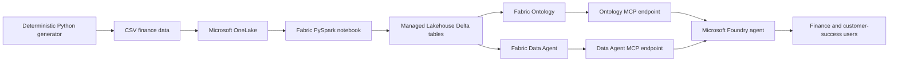
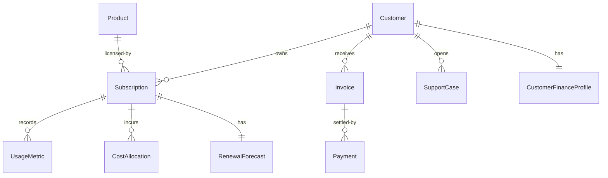

# SAS Finance Intelligence with Microsoft Fabric IQ

An end-to-end, synthetic finance and customer-success demo for a SAS analytics
company. It combines a Microsoft Fabric Lakehouse, managed Delta tables, Fabric
Ontology, Fabric Data Agent, and optional Microsoft Foundry integration through
Model Context Protocol (MCP).

> All companies, people, transactions, forecasts, and financial values in this
> repository are fictional and intended only for demonstrations.

## Business use case

Finance and customer-success teams often make renewal decisions from separate
systems: subscriptions, billing, product telemetry, support, cloud cost, and
forecasting. This demo connects those signals into a semantic model that can
answer questions such as:

- Which customers have declining usage, critical support cases, and renewals in
  the next 90 days?
- Which overdue invoices are associated with at-risk renewals?
- Which accounts have the lowest gross margin after cloud and support costs?
- What explains a customer's renewal forecast?
- What finance and customer-success action should be taken next?

The generated scenario contains healthy, expanding, watch-list, and at-risk
customers. The data reconciles to:

| Metric | Demo value |
|---|---:|
| Active customers | 12 |
| Active subscriptions | 12 |
| Six-month billed revenue | $2,214,000 |
| Six-month cash collected | $2,047,500 |
| Accounts receivable | $166,500 |
| ARR with renewal probability below 60% | $948,000 |

## Architecture



`deploy.py` creates or updates the complete Fabric path. Definitions are built
at deployment time so workspace and Lakehouse IDs are never hard-coded.

## Data model

| Table | Purpose |
|---|---|
| `customers` | Customer, industry, geography, segment, and account owner |
| `products` | SAS analytics products and list ARR |
| `subscriptions` | Contract, ARR, licensed users, and renewal date |
| `invoices` | Billing, due dates, payment status, and overdue balances |
| `payments` | Cash receipts by invoice |
| `usage_monthly` | Adoption, active users, compute hours, and production jobs |
| `support_cases` | Severity, status, age, and support effort |
| `cloud_costs` | Compute, storage, and support cost allocation |
| `renewal_forecasts` | Probability, category, reason, and recommended action |
| `customer_finance_summary` | Reconciled executive finance and risk profile |

The ontology contains ten entity types and nine relationships:



## Repository contents

```text
.
|-- data/                         # Deterministic synthetic CSV data
|-- fabric/
|   `-- load_finance_tables.py    # Fabric PySpark notebook source
|-- tests/                        # Reconciliation and definition tests
|-- build_assets.py               # Ontology and Data Agent definition builder
|-- deploy.py                     # Idempotent Fabric deployment
|-- generate_data.py              # Synthetic finance data generator
`-- requirements.txt
```

## Run locally

### Prerequisites

- Python 3.11 or later
- No Azure account is required for data generation or tests

### Setup

```powershell
python -m venv .venv
.\.venv\Scripts\Activate.ps1
python -m pip install -r requirements.txt
```

Generate a fresh, deterministic dataset:

```powershell
python .\generate_data.py
```

Run the reconciliation and Fabric-definition tests:

```powershell
python -m unittest discover -s .\tests -v
```

The generator writes ten CSV files and `data/quality_report.json`. Re-running it
produces the same business scenarios and totals.

## Deploy to Microsoft Fabric

### Prerequisites

- Azure CLI installed and authenticated
- A Microsoft Fabric workspace on active capacity
- Workspace Contributor or Admin access
- Fabric Ontology and Data Agent preview features enabled for the tenant
- **F64 or higher capacity for the Data Agent MCP runtime**

Ontology can be created on smaller Fabric capacities, but Data Agent MCP calls
return `FTL64 SKU Not Supported` when the workspace uses a trial `FTL64` or a
Fabric SKU below F64.

### 1. Authenticate

Use the tenant and subscription that contain the target Fabric capacity:

```powershell
az login --tenant <tenant-id>
az account set --subscription <subscription-id>
az account show --query "{user:user.name,tenant:tenantId,subscription:id}" -o json
```

### 2. Create or select a Fabric workspace

Create a workspace in the Fabric portal and assign it to F64-or-higher
capacity. Copy the workspace ID from its browser URL:

```text
https://app.fabric.microsoft.com/groups/<workspace-id>/
```

You can also use an existing capacity-backed workspace. Do not use a trial
workspace if you need the Data Agent MCP endpoint.

### 3. Deploy

From the repository root:

```powershell
python .\deploy.py `
  --workspace-id <workspace-id> `
  --workspace-name "<workspace-display-name>"
```

The deployment performs these steps:

1. Regenerates and reconciles all finance data.
2. Creates or reuses `SASFinanceLakehouse`.
3. Uploads CSV files to `Files/raw` in OneLake.
4. Creates or updates `Load SAS Finance Demo`.
5. Runs the notebook to materialize ten managed Delta tables.
6. Validates a Delta transaction log for every table.
7. Creates or updates `SAS_Finance_Customer_Intelligence`.
8. Creates or updates the published `SAS Finance Intelligence Agent`.
9. Writes local `deployment-state.json` with item IDs and MCP endpoints.

The script is idempotent: running it again updates matching items instead of
creating duplicates. `deployment-state.json` and generated tenant-bound
definitions are intentionally ignored by Git.

### 4. Validate in Fabric

Open the target workspace and confirm:

- `SASFinanceLakehouse` contains all ten tables.
- `Load SAS Finance Demo` shows a completed run.
- `SAS_Finance_Customer_Intelligence` contains ten entities and nine
  relationships.
- `SAS Finance Intelligence Agent` is published.

The script also reports row counts, financial reconciliation, Delta validation,
and these MCP endpoint patterns:

```text
https://api.fabric.microsoft.com/v1/mcp/dataPlane/workspaces/{workspaceId}/items/{ontologyId}/ontologyEndpoint

https://api.fabric.microsoft.com/v1/mcp/workspaces/{workspaceId}/dataagents/{dataAgentId}/agent
```

## Demo walkthrough

1. **Start with the finance summary.** Show total ARR, billed revenue, cash
   collection, outstanding AR, and at-risk ARR.
2. **Ask for renewal risk.** Use:
   `Which customers are at risk of renewal, and why?`
3. **Connect operational signals.** Use:
   `Which customers have declining usage and open critical support cases?`
4. **Add financial context.** Use:
   `Which overdue invoices are associated with at-risk renewals?`
5. **Inspect profitability.** Use:
   `Rank customers by gross margin and explain the bottom three.`
6. **Recommend action.** Use:
   `Recommend the next finance and customer-success action for each at-risk customer.`
7. **Show semantic grounding.** In the Ontology, trace Customer to Subscription,
   Invoice, SupportCase, RenewalForecast, and CustomerFinanceProfile.

Expected highlights include:

- **Contoso Health:** declining adoption and an open critical case.
- **Alpine Insurance:** declining usage, overdue AR, and low renewal probability.
- **Tailspin Energy:** softening usage with rising cost pressure.
- **Northstar Bank and Blue Yonder Airlines:** strong expansion candidates.

## Step-by-step demo execution

Use this 15-20 minute flow for a live customer presentation. Complete the
pre-demo checks before the audience joins.

### 1. Prepare the environment

1. Open the target workspace in
   [Microsoft Fabric](https://app.fabric.microsoft.com/).
2. Confirm that the workspace is assigned to active **F64 or higher** capacity.
3. Confirm that these items are present:
   - `SASFinanceLakehouse`
   - `Load SAS Finance Demo`
   - `SAS_Finance_Customer_Intelligence`
   - `SAS Finance Intelligence Agent`
4. Open the notebook run history and confirm the most recent run completed.
5. Open `SASFinanceLakehouse` and confirm that all ten tables are visible.
6. Open the Ontology item. If Fabric indicates that its graph data is stale,
   select **Refresh graph model** or save the model, and wait for refresh to
   complete.
7. Open the Data Agent and confirm that it is published and that
   `SASFinanceLakehouse` is its selected data source.

If an item or table is missing, rerun the idempotent deployment:

```powershell
python .\deploy.py `
  --workspace-id <workspace-id> `
  --workspace-name "<workspace-display-name>"
```

### 2. Introduce the business problem

Set the scene:

> A SAS analytics company wants one governed view of customer value and renewal
> risk. Finance sees invoices and margin, Customer Success sees adoption and
> support, and Sales sees renewal forecasts. Fabric IQ connects those signals
> so people and AI agents reason from the same business context.

Show the architecture diagram in this README and explain the progression:

1. Synthetic source data lands in OneLake.
2. A Fabric notebook creates managed Delta tables.
3. Ontology adds business entities and relationships.
4. Data Agent translates natural-language questions into governed analytical
   queries.
5. Foundry can orchestrate the Ontology and Data Agent through MCP.

### 3. Prove the financial reconciliation

1. Open the SQL analytics endpoint associated with `SASFinanceLakehouse`.
2. Create a new SQL query.
3. Run:

```sql
SELECT
    SUM(billed_revenue_6m) AS billed_revenue_6m,
    SUM(cash_collected_6m) AS cash_collected_6m,
    SUM(ar_outstanding) AS ar_outstanding,
    SUM(CASE
        WHEN renewal_probability < 0.60 THEN arr
        ELSE 0
    END) AS at_risk_arr
FROM dbo.customer_finance_summary;
```

Verify these anchors:

| Metric | Expected value |
|---|---:|
| Billed revenue | $2,214,000 |
| Cash collected | $2,047,500 |
| Accounts receivable | $166,500 |
| At-risk ARR | $948,000 |

Explain that the summary is reconciled from invoice, payment, cost, usage,
support, and forecast records rather than being an isolated dashboard metric.

### 4. Find the customers that require intervention

Run:

```sql
SELECT
    customer_name,
    arr,
    renewal_date,
    renewal_probability,
    usage_trend_pct,
    open_critical_cases,
    overdue_ar,
    risk_reason,
    recommended_action
FROM dbo.customer_finance_summary
WHERE renewal_probability < 0.60
ORDER BY renewal_probability;
```

The query should identify:

| Customer | Renewal probability | Primary signal |
|---|---:|---|
| Alpine Insurance | 35% | Usage decline, critical support issue, and overdue AR |
| Contoso Health | 48% | Usage decline and open critical support case |
| Lucerne Publishing | 58% | Four consecutive months of declining usage |

Point out that these three customers account for the full **$948,000 at-risk
ARR**.

### 5. Explore the Ontology

1. Open `SAS_Finance_Customer_Intelligence`.
2. On the model canvas, select the `Customer` entity.
3. Show its relationships to `Subscription`, `Invoice`, `SupportCase`, and
   `CustomerFinanceProfile`.
4. Follow `Subscription` to `Product`, `UsageMetric`, `CostAllocation`, and
   `RenewalForecast`.
5. Open an Alpine Insurance or Contoso Health instance.
6. Explain that the entity key bindings connect records across operational and
   financial tables without duplicating business logic in every agent prompt.

Use the Ontology natural-language experience, if enabled, to ask:

```text
Show the business context for Alpine Insurance, including its subscription,
invoices, support cases, usage, renewal forecast, and finance profile.
```

The response should connect the customer to its related records instead of
returning an unstructured keyword search.

### 6. Run the Data Agent conversation

Open `SAS Finance Intelligence Agent` and start a new conversation.

Ask each prompt separately:

1. ```text
   Which customers are at risk of renewal, and why?
   ```
   Confirm that Alpine Insurance, Contoso Health, and Lucerne Publishing are
   returned with probabilities and observed risk drivers.

2. ```text
   Which customers have declining usage and open critical support cases?
   ```
   Confirm that Contoso Health and Alpine Insurance are highlighted.

3. ```text
   Which overdue invoices are associated with at-risk renewals?
   ```
   Confirm that the answer links invoice status to customer and renewal
   context, rather than listing invoices alone.

4. ```text
   Rank customers by gross margin percentage and explain the bottom three.
   ```
   Confirm that the answer uses billed revenue and allocated cloud/support
   costs.

5. ```text
   Recommend the next finance and customer-success action for every at-risk
   customer. Include ARR, renewal probability, usage trend, support risk, and
   overdue receivables.
   ```
   Confirm that recommendations cite the underlying signals and do not invent
   values.

Remind the audience that the Data Agent instructions define ARR, margin,
renewal-risk thresholds, overdue AR, and declining adoption so those meanings
remain consistent across questions.

### 7. Demonstrate the Foundry handoff

If a Microsoft Foundry project and model are configured:

1. Open the Foundry agent connected to the Fabric IQ MCP endpoints.
2. Ask:

   ```text
   Prepare an executive renewal-risk briefing. Use the ontology to explain the
   related customer context and the Data Agent to quantify the financial and
   operational evidence. Recommend the next action for each at-risk account.
   ```

3. Confirm that the response combines relationship reasoning with governed
   metrics.
4. Show that Fabric permissions continue to govern source access.

If Foundry is not configured, show the two endpoint patterns in the deployment
output and explain that they allow Foundry, Copilot Studio, or another
MCP-compatible client to reuse the same governed Fabric intelligence.

### 8. Close with business value

Conclude with three outcomes:

1. **Faster decisions:** Finance, Sales, and Customer Success see the same
   renewal and profitability signals.
2. **Explainable AI:** Every recommendation is grounded in modeled entities,
   relationships, and governed metrics.
3. **Reusable intelligence:** The same Ontology and Data Agent can support
   Fabric experiences, Foundry agents, Copilot Studio, and custom MCP clients.

## Connect to Microsoft Foundry

After deploying a Foundry project and model, add the Fabric IQ knowledge source
or MCP connection using the endpoints from `deployment-state.json`. Configure
the Foundry agent to:

- use Ontology for entity/relationship reasoning,
- use Data Agent for governed analytical queries,
- quantify answers with finance metrics,
- cite the supporting customer, subscription, invoice, usage, support, and
  forecast records,
- state that the data is synthetic.

Fabric IQ, Ontology, Data Agent, and their Foundry integrations are preview
features. Confirm current regional, capacity, tenant-setting, and identity
requirements before production use.

## Security and cleanup

- The repository contains no customer data or credentials.
- Azure access tokens are acquired from Azure CLI and are never written to disk.
- Use least-privilege workspace roles.
- Delete the four demo items or the dedicated workspace when finished to stop
  ongoing capacity usage.

## License

This project is licensed under the MIT License.
